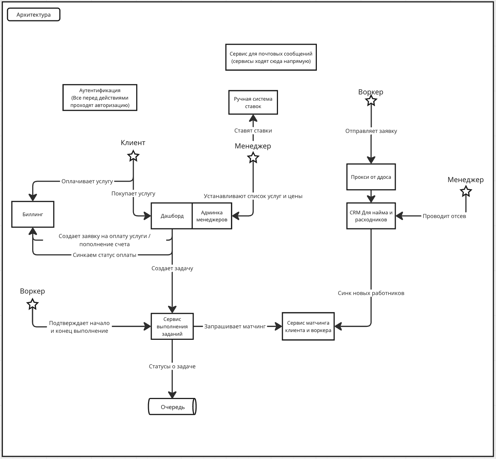

Обоснование системы
===================

Сервисы приложения
------------------

Основной поддомен:
- **Сервис матчинга клиента и воркера** - представляет УТП, может быть сложной системой в будущем. 
Заранее выделяем в отдельный сервис, который будем разрабатывать через DDD c +- управляемой сложностью.
- **Сервис для выполнения заданий** - будет содержать в себе основной флоу выполнения заданий, главный функционал
приложения. Может усложняться в дальнейшем с добавлением новых услуг, поэтому выпделяем в отдельный сервис, 
чтобы регулировать сложность.

Вспомогательный поддомен:
- **Дашборд клиента + Админка менеджеров** - не содержит в себе ничего уникального или сложной бизнес логики.
Отдельный сервис с 2-мя модулями: для покупки услуг/заявок и отображения их статусов, 
а также админки для управления услугами и их стоимостью. Будут использовать единую базу данных и много общих
сущностей, поэтому выделяем в общий сервис.
- **Система ставок** - в начале простой блокнот. Не представляет ценности для продукта. В дальнейшем может вырасти
в отдельный сервис, который будут писать новенькие и джуны.

Универсальный поддомен:
- **Сервис аутентификации** - сервис, который содержит много общедоступных модулей для интеграции удобной авторизации
через другие сервисы/ldap.
- **Сервис для отправки почтовых сообщений** - есть готовые опенсорс решения, нужно просто поддерживать и обновлять его.
- **Биллинг** - есть почти в каждом продукте с оплатой. Должны быть готовые решения, чтобы ускорить разработку, просто
подключимся к ним.
- **CRM для управления которесурсами/расходниками** - наверное есть готовые решения, можно отдать на оутсорс.

Архитектура
-----------

Способы коммуникации
--------------------

Не успел расписать, но большая часть коммуникаций будет через HTTP (маленький RPS, нет смысла думать над нагрузкой).
Очередь будем использована для основных поддоменов, чтобы убрать зависимость от вспомогательных и универсальных поддоменов.

Критичные места
---------------

Не продумана:
- денежная система (возврат средств, скидки и тд)
- управление воркерами (как должны появляться в системе и удаляться)
- как управлять расходниками
- как проверять качество работ
- как работать с фидбеком от клиентов
