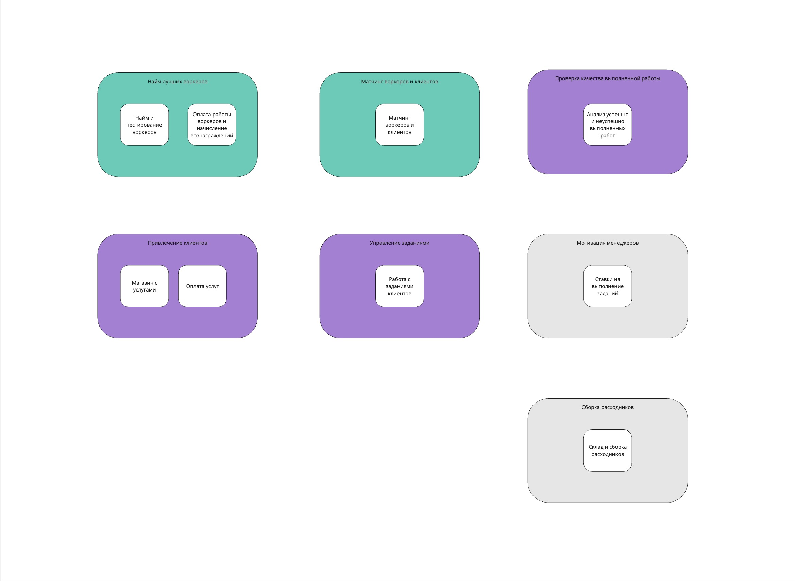

Урок 2
======

Поиск поддоменов
----------------

Акторы:
- Клиенты
- Воркеры
- Менеджеры по услугам
- Найм-Менеджеры
- Сотрудники отдела расходников
- Подрядчик печенья
- Quality-Менеджеры
- Бухгалтерия

Поддомены
---------

Основной домен: уменьшение посторонней работы клиентов (для мвп только котов-тестировщиков).

Уникальность компании: отсев котов воркеров и матчинг между клиентами и воркерами.

Поддомены:
- **Привлечение клиентов** - Решает проблему покупки услуг и привлечение новых клиентов
- **Найм воркеров** - Решает проблему найма воркеров, которые являются лучшими исполнителями
- **Матчинг воркеров и клиентов** - Решает проблему матчинга между клиентами и воркерами
- **Управление заданиями** - Решает проблему выполнения флоу задачи
- **Мотивация менеджеров** - Решаем проблему найма сотрудников в компанию и их удержание
- **Проверка качества выполненной работы** - Решает проблему создания новых гипотез для развития бизнеса и поиска проблемных воркеров
- **Сборки расходников** - Решает проблему выдачи необходимых расходников для выполнения задачи воркером

| Вид поддомена                        | Конкурентное преимущество | Сложность доменной модели | Изменчивость | Варианты реализации | Интерес проблемы | Предполагаемый вид поддомена |
|--------------------------------------|---------------------------|---------------------------|--------------|---------------------|------------------|------------------------------|
| Привлечение клиентов                 | Нет                       | Низкая                    | Частая       | ???                 | Низкий           | Generic/Supporting           |
| Найм воркеров                        | Да                        | Высокая                   | Частая       | Инхаус              | Высокий          | Core                         |
| Матчинг воркеров и клиентов          | Да                        | Высокая                   | Частая       | Инхаус              | Высокий          | Core                         |
| Управление заданиями                 | Нет                       | Высокая                   | Частая       | Инхаус              | Средний          | Supporting                   |
| Мотивация менеджеров                 | Нет                       | Низкая                    | Низкая       | ???                 | Низкий           | Generic                      |
| Проверка качества выполненной работы | Нет                       | Высокая                   | Частая       | ???                 | Средний          | Supporting                   |
| Сборки расходников                   | Нет                       | Низкая                    | Низкая       | ???                 | Низкий           | Generic                      |

График с поддоменами
--------------------

Поддомены с боундед-контекстами
-------------------------------

Ссылка на [поддомены с контекстами](https://miro.com/app/board/uXjVK7erPVo=/?moveToWidget=3458764593065019420&cot=14).

Расхождением между боундед-контекстом из поддомена и боундед-контекста, полученного из ES
-----------------------------------------------------------------------------------------

В ES у меня получилось объединить в один контекст биллинг (оплата воркерам + списание средств клиентов). 
Но анализируя бизнес я выяснил, что оплату и списание нужно разделить, так как это разные процессы. 
Поэтому контекст оплаты перенес в домен найма, а списание средств к домену привлечения клиентов.

[Итоговая схема ES](https://miro.com/app/board/uXjVK7erPVo=/?moveToWidget=3458764593101496999&cot=14).

Определение характеристики, важные для проекта
----------------------------------------------

Явные требования:
- Низкий ТТМ (Time To Market)
- 10 заказов в день и 100 клиентов
- 20 воркеров
- Высокая изменяемость тестирования котов и проверка гипотез.
- 1000 заявок в день от котов + возможность ддоса

Неявные требования
- Рост количества клиентов, за счет выхода на рынок, а не только на внутренних сотрудников
- Компания находится на этапе идеи, а значит высокой неопределенности и прототипирования

Важные характеристики для проекта:
- Scalability - Насколько система справляется с ростом нагрузки. (Рост количества клиентов)
- Agility - Составная характеристика, которая обозначает «гибкость» системы — умение 
подстраиваться под изменения во внешнем мире (Неопределенность + проверка новых гипотез)
- Testability - Характеризует простоту или полноту тестирования (Большое количество изменений не должно приводить к поломкам)
- Deployability - Измеряет простоту и скорость деплоймента новой функциональности (Низкий ТТМ)
- Maintainability - Ремонтопригодность — сложность восстановления системы после поломок или 
изменения других характеристик (Большое количество изменений не должно приводить к поломкам)

Таблица с характеристиками:

Выбор архитектурного стиля
--------------------------

Исходя из потребностей бизнеса выделяются 2 архитектурных стиля: sevice-based и microservices. 
Но больше звезд у **микросервисов**. Поэтому остановим выбор на нем.

Количество сервисов будет аналогично количеству bounded-context'ов:
- Найм воркеров
- Сайт с услугами
- Матчинг
- Упаковка расходников
- Выполнение заданий
- Оплата услуг
- Оплата работы воркеров
- Ставки
- Изучение качества выполненных работ

Взаимодействие между сервисами будет синхронным, **кроме** события о завершении задания, которое будет асинхронным.
Все сервисы, которые вызываются от этого события будут считывать его самостоятельно, 
для этого будет использоваться шина событий (очередь).
