Урок 3
======

Стейкхолдеры и ограничения
--------------------------

В качестве дополнительных стейкхолдеров были добавлены:
- Найм-менеджеры - были выделены из менеджеров. Отвечают за поиск и тестирование новых воркеров.
- Сотрудники склада - отвечают за выдачу расходников воркерам.

Матрица "Влияние - Интерес":
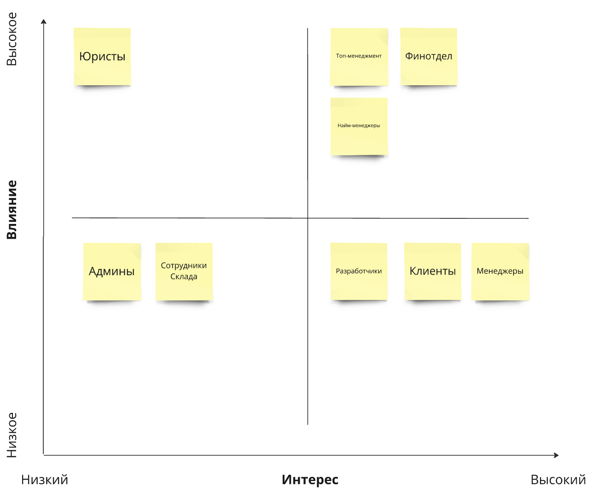

Высокое влияние - высокий интерес:
- Топ-менеджмент - хотят извлечь максимальную пользу из продукта
- Финотдел - им важно организовать корректные выплаты и правильное списание средств, а также сохранность данных
- Найм-менеджеры - участвуют в core части продукта, которая выделяет их среди конкурентов

Высокое влияние - низкий интерес:
- Юристы - им важно, чтобы все соответствовало нормам, но в самом продукте не сильно заинтересованы

Низкое влияние - высокий интерес:
- Разработчики - интересно разрабатывать продукт, уровень влияния не известен. Выбрал низкий так как роль исполнителей
- Клиенты - хотят получить удобный и качественный продукт, но не могут влиять на развитие продукта
- Менеджеры - хотят получить удобный и качественный продукт, но не все требования можно учитывать

Низкое влияние - низкий интерес:
- Админы - хотят удобство в обслуживании, но это не критично
- Сотрудники склада - хотят удобство в использовании, но это не критично

Стейкхолдеры и консерны приоритезированные по уровню влияния:

| ID | Стейкхолдер       | Консёрны                                                                                                                                                                                                                                                                                                                                                                                                                   |
|----|-------------------|----------------------------------------------------------------------------------------------------------------------------------------------------------------------------------------------------------------------------------------------------------------------------------------------------------------------------------------------------------------------------------------------------------------------------|
| 1  | Топ-менеджмент    | скоринг потенциальных работников уникален в своём роде, и логика его работы сильно выше, чем планировалось. Бизнес в будущем хочет продавать его другим компаниям и тестировать больше гипотез; релизный цикл для всей системы — месяц, для скоринга работников — неделя максимум. хочет, чтобы система была максимально во власти компании                                                                          |
| 2  | Финотдел          | списывать деньги с клиентов каждую неделю слишком затратно для отдела, поэтому они хотят списывать деньги раз в месяц, но платить воркерам и дальше раз в месяц. При этом необходимо постоянно добавлять новые способы списания денег для клиентов. Воркеры всегда работают через компанию «Золотая шляпа»; боятся потерять любую финансовую информацию и хотят решение, которое будет гарантировать, что всё будет ок. |
| 3  | Найм-менеджеры    | -                                                                                                                                                                                                                                                                                                                                                                                                                          |
| 4  | Юристы            | соответствие всей системы правовым нормам.                                                                                                                                                                                                                                                                                                                                                                                 |
| 5  | Разработчики      | система должна работать без сбоев, а если сбой случается, то должно быть понятно, что и где чинить.                                                                                                                                                                                                                                                                                                                        |
| 6  | Клиенты           | ожидаемое поведение системы: без сбоев и тупняков.                                                                                                                                                                                                                                                                                                                                                                         |
| 7  | Менеджеры         | хотят, чтобы о системе ставок не знали другие отделы, иначе будет некрасивая ситуация. Они хотят скрыть эту систему даже от разработчиков, которые не будут ей заниматься, и от начальства; выяснилось, что котам из Happy Cat Box наш проект понравился, поэтому приходит не 10 заказов в день, а 10 заказов в минуту.                                                                                                 |
| 8  | Админы            | простота мониторинга системы для своевременного замечания сбоев, чтобы не работать в авральном режиме.                                                                                                                                                                                                                                                                                                                     |
| 9  | Сотрудники Склада | -                                                                                                                                                                                                                                                                                                                                                                                                                          |

Описание характеристик
----------------------

Схема [поддомены и bounded-контексты](https://miro.com/app/board/uXjVK7erPVo=/?moveToWidget=3458764593065019420&cot=14):
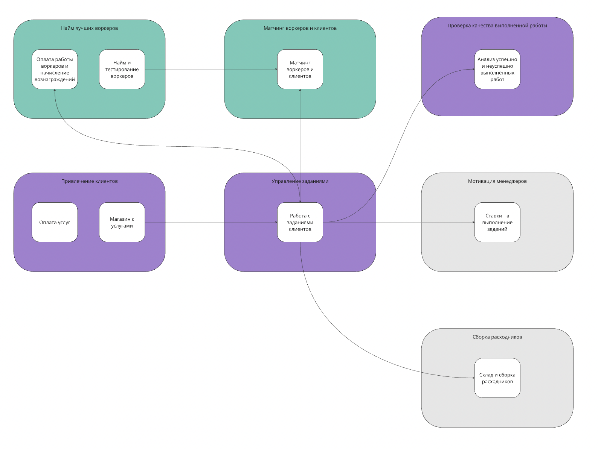

---

Схема [характеристики системы по контекстам](https://miro.com/app/board/uXjVK7erPVo=/?moveToWidget=3458764593645999042&cot=14):
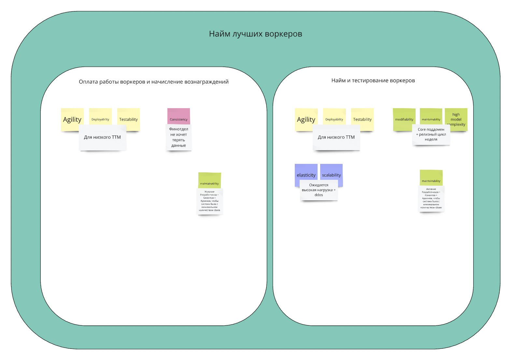
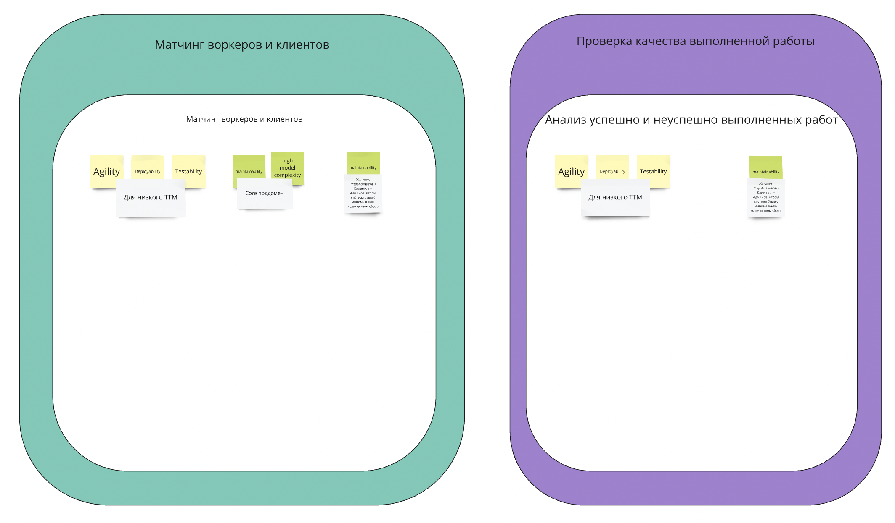
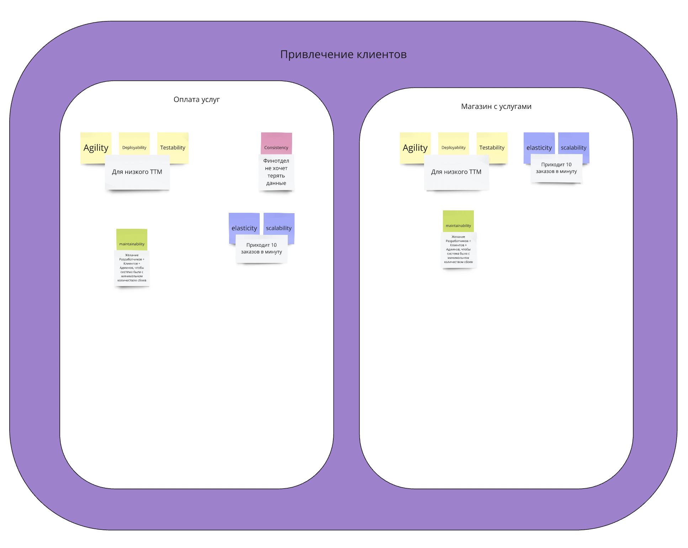
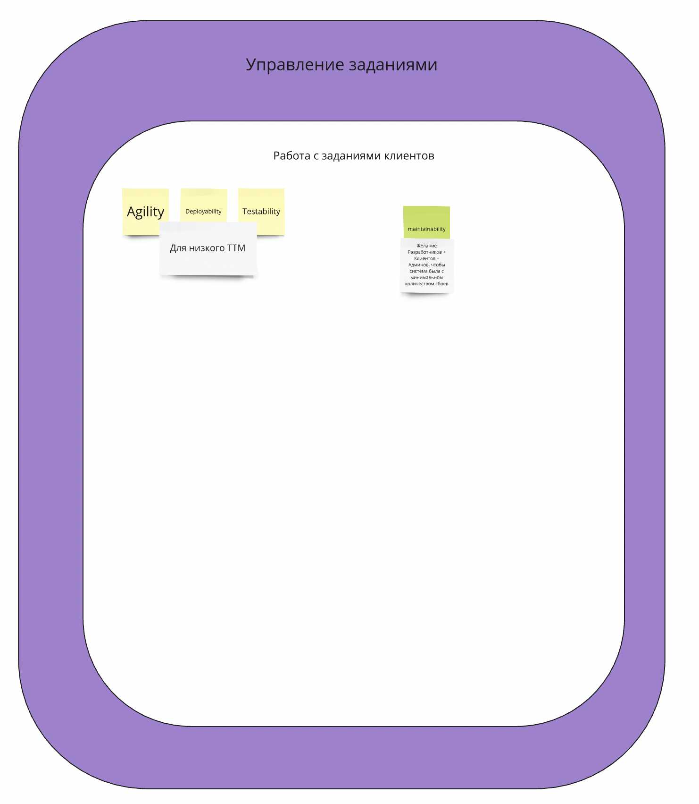
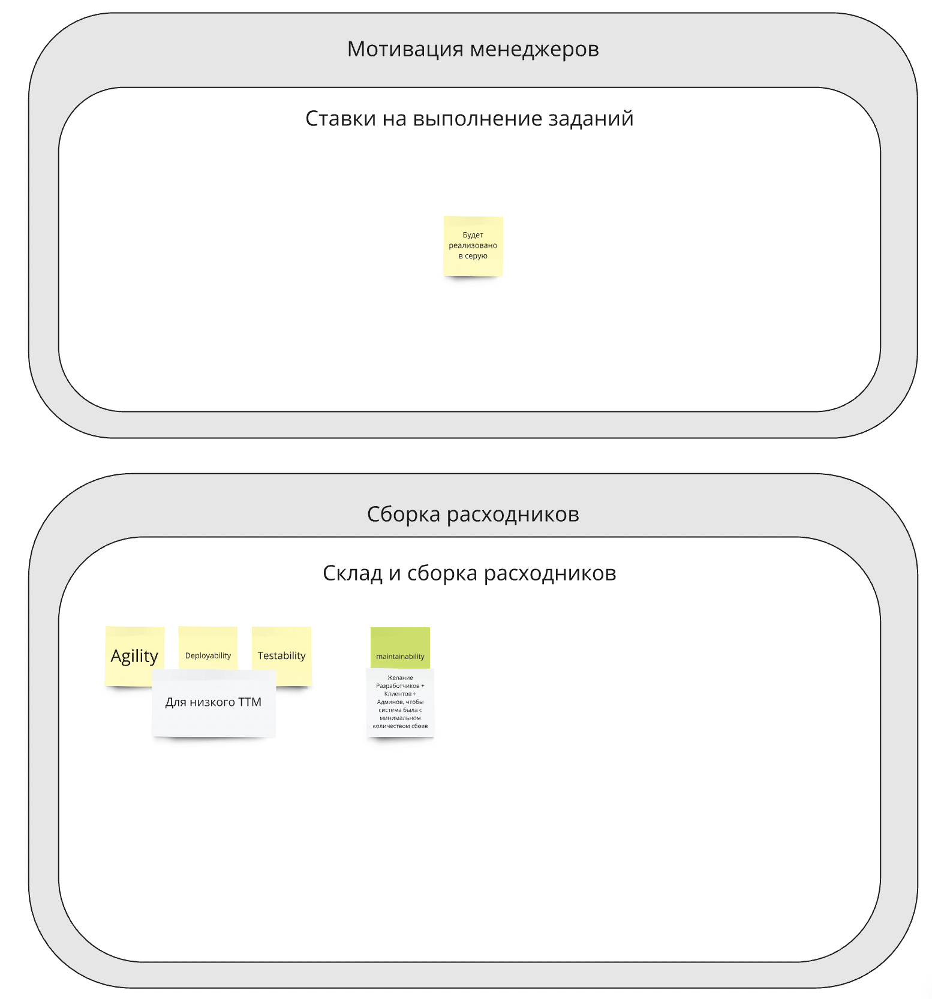

---

Характеристики общие для системы:
- agility - низкий ТТМ
- deployability - низкий ТТМ
- maintainability - требование Клиентов, Разработчиков и Админов
- testability - низкий ТТМ

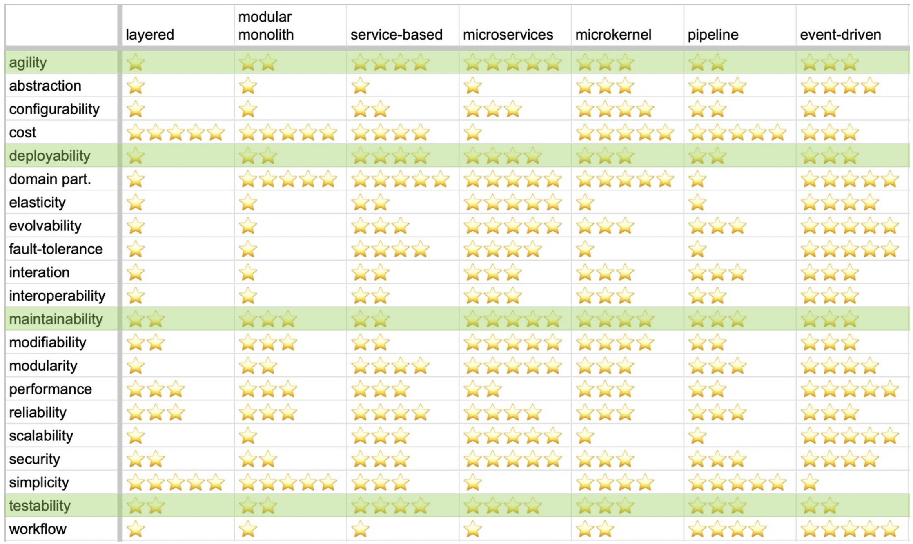

По итогу выбор - **microservices**

---

Общая таблица для понимания выбранных стилей каждого отдельного микросервиса:
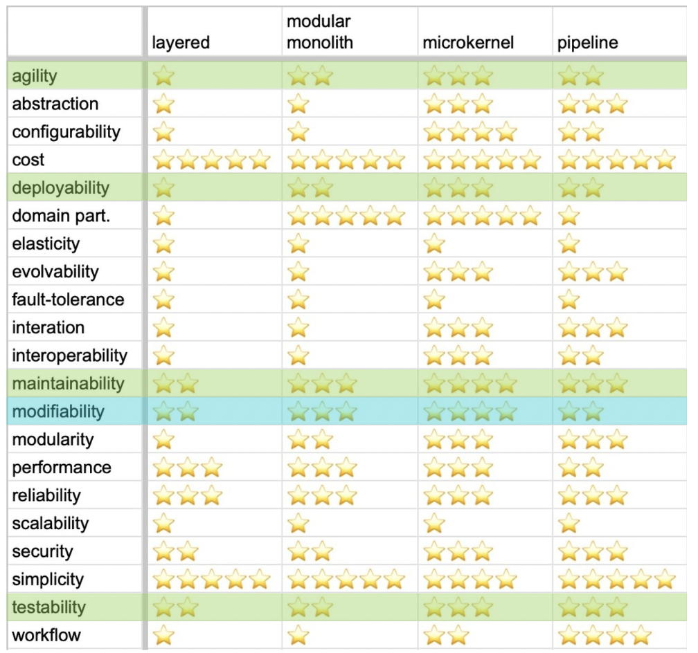

Важно: по моим характеристикам почти везде нужно использовать microkernel. Но на практике явно я с ним
не успел столкнуться. Поэтому как вариант реализации решил не использовать, кроме одного сервиса.

Стили каждого отдельного микросервиса:
- Оплата работы воркеров и начисление вознаграждений - **modular monolith**, так как оплата будет меняться редко, а способ оплаты единственный.
- Найм и тестирование воркеров - **modular monolith**, так как нужна high model complexity
- Матчинг воркеров и клиентов - **pipeline**, так как нужна high model complexity, и по новому требованию 
тестирование будет состоять из нескольких шагов и алгоритма map-reduce (напоминает use cases Airflow)
- Анализ успешно и неуспешно выполненных работ - **modular monolith/layered**
- Оплата услуг - **microkernel**, так как собираются подключать разные способы оплаты
- Магазин с услугами - **modular monolith/layered**
- Работа с заданиями клиентов - **modular monolith/layered**
- Ставки на выполнение заданий - не будет технически реализован, так как не хотят привлекать разработчиков
- Склад и сборка расходников - **modular monolith/layered**

Выбор базы данных
-----------------

База данных под каждый сервис:
- Оплата работы воркеров и начисление вознаграждений - по требованию финотдела в consistency, был выбран RDBMS
- Найм и тестирование воркеров - так как ожидается высокая нагрузка на выбор RDBMS/Key-Value
- Матчинг воркеров и клиентов - предположительно будет много чтений данных для анализа поэтому Column Family
- Анализ успешно и неуспешно выполненных работ - RDBMS, так как оптимальная и знакомая БД
- Оплата услуг - по требованию финотдела в consistency, был выбран RDBMS
- Магазин с услугами - так как ожидается высокая нагрузка на выбор RDBMS/Key-Value
- Работа с заданиями клиентов - RDBMS, так как оптимальная и знакомая БД
- Ставки на выполнение заданий - не будет технически реализован, так как не хотят привлекать разработчиков
- Склад и сборка расходников - RDBMS, так как оптимальная и знакомая БД

Выбор коммуникаций
------------------

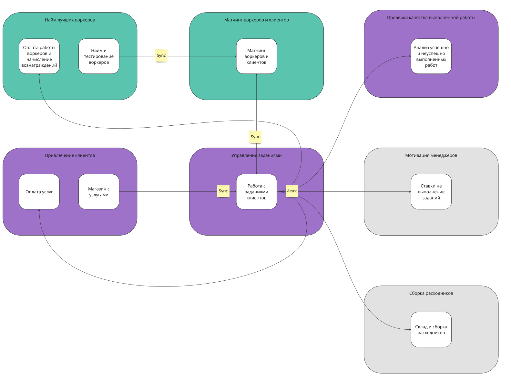

Исходящее событие о завершении задачи из сервиса "Работа с заданиями клиентов" было выбрано Async:
1) Так как хочется убрать зависимость от других сервисов
2) При отправке события не нужно получать ответ
3) Нужно отправить в множество сервисов

Создания задания "Магазин с услугами" -> "Работа с заданиями клиентов" было выбрано Sync:
1) Хочется получить ответ о создании задания и убедиться что оно пойдет в работу

Получение матчинга воркера к заданию в "Работа с заданиями клиентов" -> "Матчинг воркеров и клиентов" было выбрано Sync:
1) Так как это запрос на получение данных
2) Но если матчинг будет долгим, можно рассмотреть Async вариант

Добавление нового воркера в "Матчинг воркеров и клиентов" был выбран Sync:
1) Так как остальные взаимодействия с сервисом "Матчинг воркеров и клиентов" Sync

Фитнес функции
--------------

- Для поддержания высокого maintainability, будет обязательно использоваться code coverage для каждого сервиса.
- Поддержание выбранного стиля будет происходить в ручном режиме
- Внедрить мониторинг таск трекера для сервиса "Найм и тестирование воркеров" для контроля временем над релизами (1 неделя по требованиям)
- Для следования выбранному стилю коммуникаций роль на создание новой очереди будет проходить через архитектора.

ADR-001: Выбор архитектурного стиля для Make cats free again
============================================================

Status: Accepted
----------------

Context
-------

Основываясь на требованиях стейхколдеров и общих желаний требований к проекту 
были выделены следующие боундед-контексты, каждый со своими характеристиками:

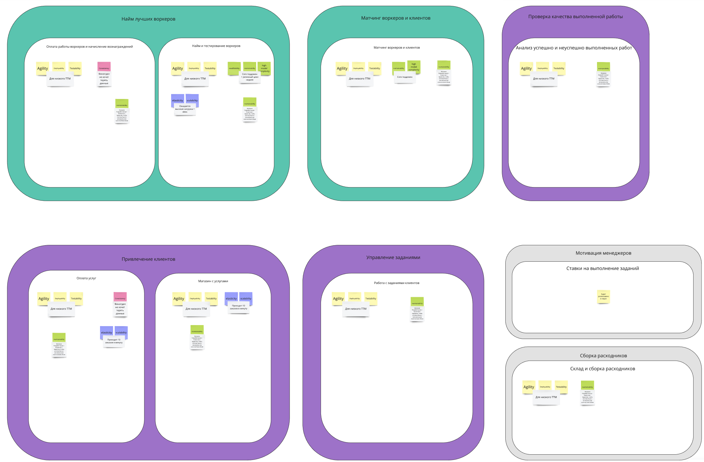
Описание каждой характеристики можете найти на схеме [характеристики системы по контекстам](https://miro.com/app/board/uXjVK7erPVo=/?moveToWidget=3458764593645999042&cot=14)

Ключевыми для выбора архитектурного стиля все системы были следующие характеристики:
- agility - для низкого ТТМ
- deployability - для низкого ТТМ
- testability - для низкого ТТМ
- maintainability - требование Клиентов, Разработчиков и Администраторов

Для определения стиля были рассмотрены следующие архитектурные стили:
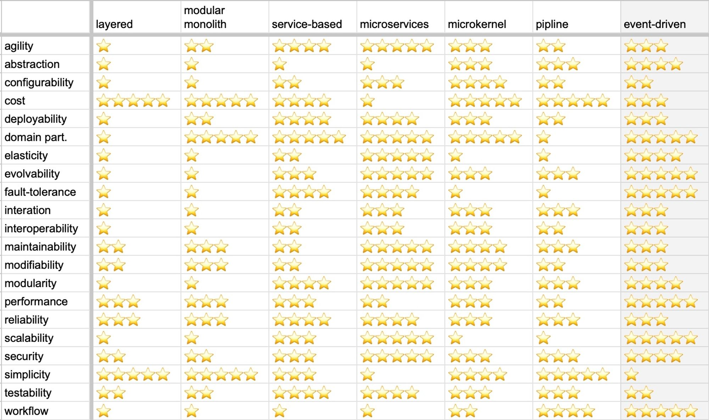

Decision: микросервисный стиль
------------------------------

Основываясь на характеристиках agility, deployability, testability и maintainability было 
принято решение использовать микросервисный стиль, так как он лучше всего подходит для реализации требований.

Каждый из боундед-контекстов будет реализован в виде отдельного сервиса, в особенности:
- "Оплата работы воркеров и начисление вознаграждений" и "Найм и тестирование воркеров" имеют разные требования и характеристики. 
В частности "Найм и тестирование воркеров" должен иметь более частый релизный цикл, чем "Оплата работы воркеров и начисление вознаграждений".
- "Оплата услуг" и "Магазин с услугами" имеют разные требования к реализации. А именно "Оплата услуг" должна подключить множество
способов оплаты, в то время как "Магазин с услугами" должен обеспечить высокую нагрузку. Из-за этого у них могут быть расхождения
в выборе архитектурного стиля и базы данных.

Compliance
----------

Так как нет возможности для автоматической проверки реализации выбранного стиля, все проверки будут делаться вручную.

Notes
-----

Архитектор: Скупов Дмитрий

Дата: 02.07.2024 вт 18:59 по МСК
