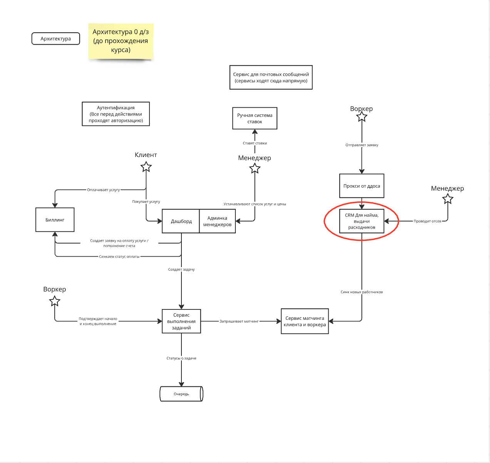
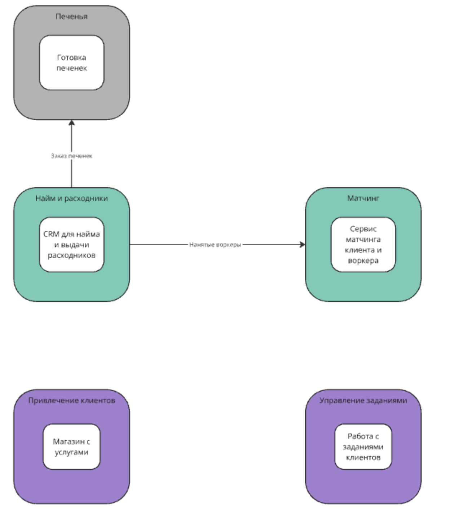
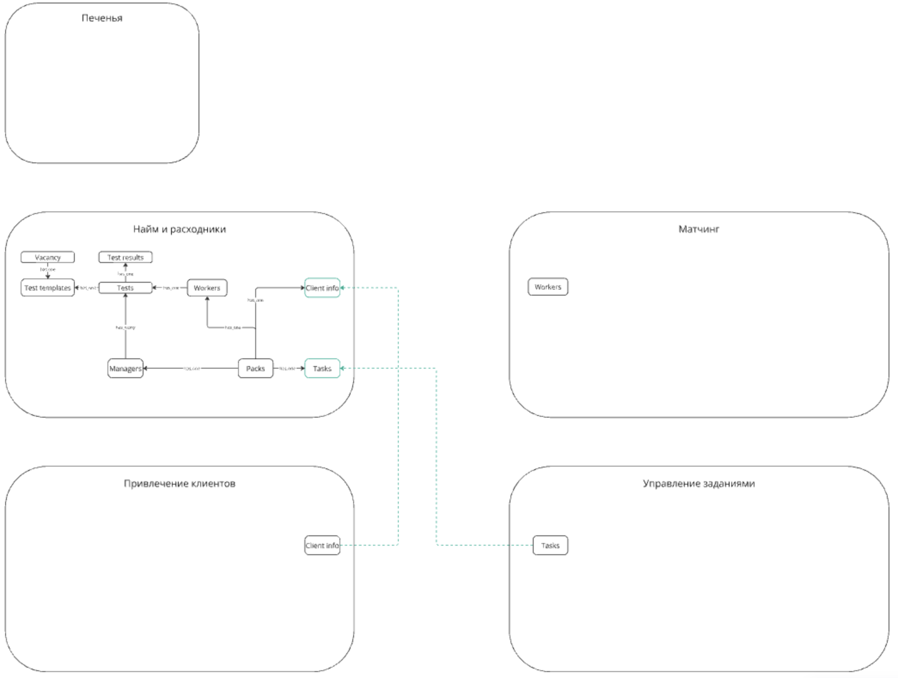
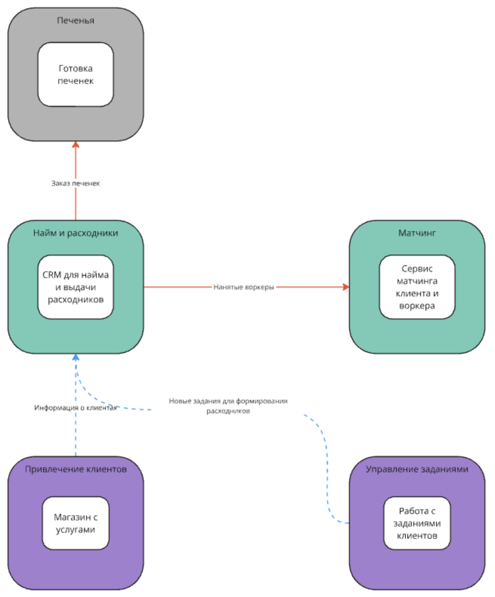
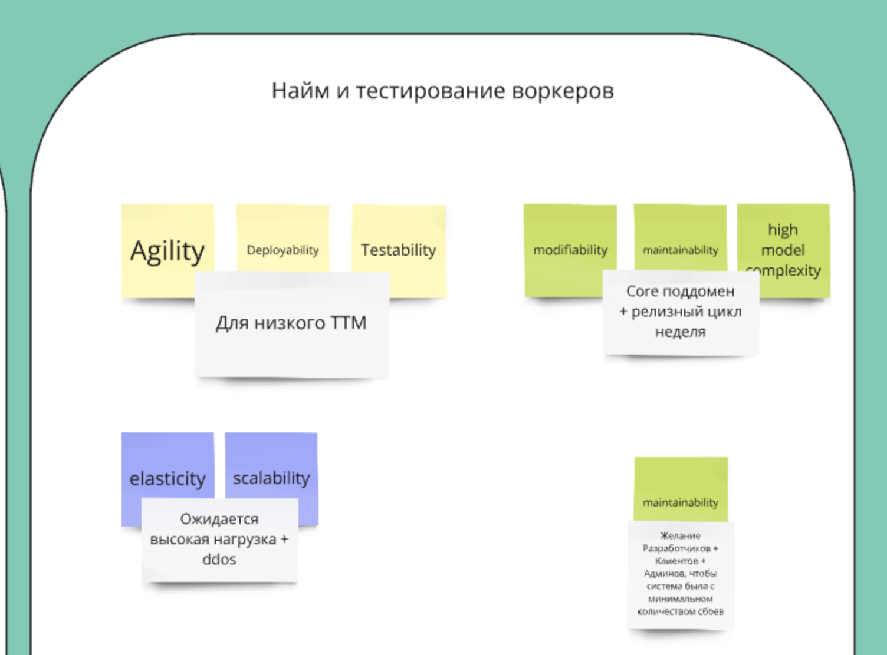
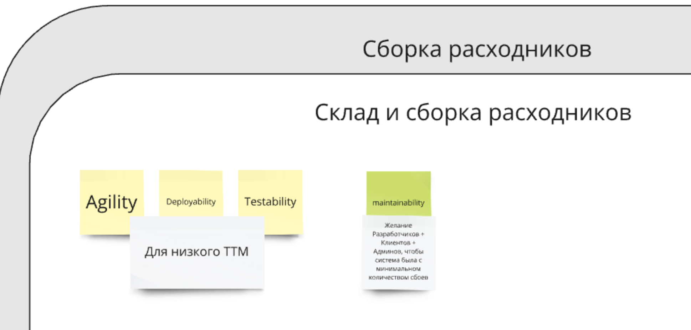
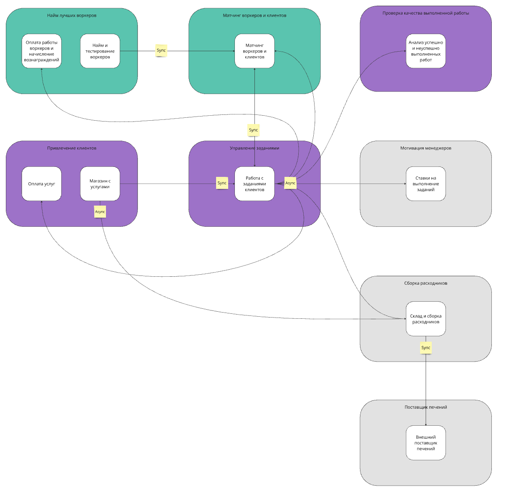

Урок 4
======

Выбор системы для исправления
-----------------------------

В качестве системы над которой буду работать было выбрано [нулевое д/з](../0_lesson/Description.md).

[Изначальная схема](https://miro.com/app/board/uXjVK7erPVo=/?moveToWidget=3458764594217779141&cot=14):

Проблемным местом системы является - "CRM для найма и выдачи расходников", где core 
поддомен найма был объединен с generic поддоменом сборки расходников. Они имеют разные 
характеристики из-за чего могла быть выбрана неправильная архитектура сервиса или бд не удовлетворяющая
потребностям бизнеса.

Так как дз было сделано на скорую руку, распишем этот сервис более подробно для нахождения 
всех входящих и выходящих связей.

[Схема вызовов команд](https://miro.com/app/board/uXjVK7erPVo=/?moveToWidget=3458764594218611058&cot=14) согласно 0-ой дз:

[Схема стриминга данных](https://miro.com/app/board/uXjVK7erPVo=/?moveToWidget=3458764594220159436&cot=14) согласно 0-ой дз:

[Итоговая схама коммуникаций](https://miro.com/app/board/uXjVK7erPVo=/?moveToWidget=3458764594220827607&cot=14) согласно 0-ой дз:

Подсчитаем instability для сервиса "CRM для найма и выдачи расходников":

Instability = Ce / (Ce + Ca) = 2 / (2 + 2) = 0.5

0.5 указывает, что у сервиса повышенная вероятность изменений.

По результатам проделанной работы из прошлых уроков, мы получил, что "Найм и тестирование воркеров" 
и "Склад и сборка расходников" имеют разные характеристики:
 

Из-за этого реализация в одном месте два этих контекста ведет к сложности в поддержке и добавления нового функционала. Изменения в 
"Склад и сборка расходников" может влиять на core сервис "Найм и тестирование воркеров". А сложность в 
"Найм и тестирование воркеров" может ухудшать поддержку в "Склад и сборка расходников".

К чему хотим прийти
-------------------

По итогу наша [схема](https://miro.com/app/board/uXjVK7erPVo=/?moveToWidget=3458764594270244212&cot=14) должна выглядеть так:

Instability (Найм и тестирование воркеров) = 0 / (0 + 1) = 0 - минимальная вероятность изменений из-за внешних систем;

Instability (Склад и сборка расходников) = 2 / (1 + 2) = 0.66 - повышенная вероятность изменений из-за внешних систем;

Но так как Найм и тестирование воркеров - относится к core поддомену, а склад и сборка расходников к generic 
нас это устраивает.

Как хотим прийти
----------------

Изначальная архитектура сервиса "CRM для найма и выдачи расходников" является layered monolith 
(предположим, так как я не описывал архитектуру сервисов в 0 д/з).

Для сервиса "Найм и тестирование воркеров" мы хотим перейти на архитектуру pipeline, так как она удовлетворяет
требованиям.

Для сервиса "Склад и сборка расходников" мы хотим оставить layered monolith, так как сервис generic и простой.

У нас есть различия в характеристиках, поэтому выбираем паттерн из группы **Code first**. Так как у нас еще и меняется 
архитектура из layered monolith на pipeline, то нам подходит способ **Strangler Fig Application**. После переноса
нужно будет только изменить нейминг сервиса "CRM для найма и выдачи расходников" на "Склад и сборка расходников"
и сервисы будут разнесены.
